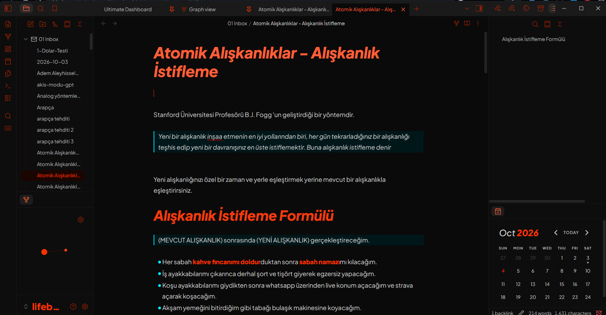

# Hyperion

A sharp, high-contrast dark theme for [Obsidian](https://obsidian.md), built around a bold orange-red accent, an electric cyan secondary color, and a zero-radius "brutalist" design language.

## Design Philosophy

Hyperion takes Obsidian's default CSS variables and rebuilds them into a dark theme that is:

- **Brutalist** — all corners are square by default (radii are set to `0px`), with crisp `miter` joins and square line caps on all icons.
- **High-contrast** — near-black backgrounds (`#0a0a0a`–`#1a1a1a`) paired with vivid accent colors.
- **Dual-accent** — orange-red (`hsl(12 100% 50%)`) as the primary accent and cyan (`hsl(185 100% 50%)`) as the secondary accent for links, lists, and quotes.
- **Typographic** — generous line heights, italic heavy headings, and bold orange text formatting.

## Features

### Typography

- **UI & text font:** [Plus Jakarta Sans](https://fonts.google.com/specimen/Plus+Jakarta+Sans) (weights 200–800)
- **Monospace font:** [Share Tech Mono](https://fonts.google.com/specimen/Share+Tech+Mono)
- Base text size of **18px** in dark mode with a **1.75** normal line height
- Heavy, italic headings (`h1`–`h6`) in a descending orange ramp
- Bold text rendered in bright orange at weight 800

### Colors

| Element                     | Color                             |
| --------------------------- | --------------------------------- |
| Primary accent (orange-red) | `hsl(12 100% 50%)`                |
| Secondary accent (cyan)     | `hsl(185 100% 50%)`               |
| Highlight background        | `hsl(185 100% 17.5%)` (deep teal) |
| Backgrounds                 | `#0a0a0a` → `#1a1a1a`             |
| Text                        | `hsl(12 0% 80%)` (warm gray)      |

### Customization Highlights

- **Code blocks** with a custom syntax palette: orange functions, amber keywords/values, muted teal properties, and a unique tag color
- **Tags** with cyan-on-dark chips that flip to orange on hover
- **Blockquotes** with a thick cyan border, deep teal background, and italic muted text
- **Tables** with dark orange headers and matching borders
- **Graph view** recolored: orange nodes and lines, cyan for tags
- **Checkboxes** in orange that switch to cyan on hover
- **Nav items** — cyan hover, orange active states
- **Pill-shaped buttons** (`--button-radius: 40px`) as the sole round element
- Squared-off toggles, sliders, inputs, and small radii applied selectively per component

## Installation

### From Obsidian

1. Open **Settings → Appearance → Manage**
2. Search for "Hyperion"
3. Click **Install**, then **Use**

### Manual

1. Download `theme.css` into your vault's `.obsidian/themes/Hyperion/` folder
2. Open **Settings → Appearance → Theme** and select **Hyperion**

> **Note:** Hyperion is a dark theme; keep Obsidian's base color scheme set to _Dark_ for the intended experience.

## Customizing

Hyperion is built entirely on Obsidian's CSS variables and grouped by component (headings, code, tags, tables, graph, checkboxes, etc.), so it's easy to tweak:

- Change `--color-accent` (and the `hsl(12 ...)` values) to shift the primary accent
- Change `--color-link` / `--list-marker-color` (and the `hsl(185 ...)` values) to shift the secondary accent
- Adjust the radii block at the top of `body` to soften or harden the look
- Reference: [Obsidian CSS variables documentation](https://docs.obsidian.md/Reference/CSS+variables/)

## Compatibility

Requires Obsidian **1.0+** (CSS variables based theming).

## License

[MIT](LICENSE)
